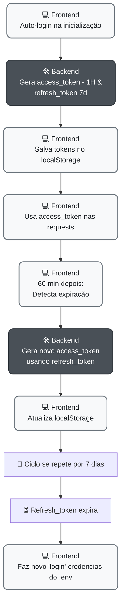

# Clientify

<div align="center">

**Sistema de Gerenciamento de Clientes Moderno e Responsivo**

[](https://reactjs.org/)
[](https://nodejs.org/)
[](https://mongodb.com/)
[](https://ui.shadcn.com/)

</div>

---

## Sobre o Projeto

O Clientify é uma aplicação web desenvolvida para facilitar o gerenciamento de clientes. A aplicação oferece uma interface moderna e intuitiva, com validações robustas e integração com APIs externas para autocompletar dados.

### Principais Funcionalidades

- Cadastro completo de clientes com validação em tempo real
- Sistema de listagem com paginação e filtros
- Edição rápida através de modais laterais
- Exclusão segura com confirmação
- Validação automática de CPF e CNPJ
- Preenchimento automático de endereço via CEP
- Interface responsiva para desktop e mobile
- Sistema de filtros por nome, email, tipo e status
- **Autenticação OAuth 2.0** com access tokens e refresh tokens
- **Renovação automática** de tokens em background
- **Proteção de rotas** com redirecionamento automático

---

## Tecnologias Utilizadas

### Frontend
- **React** com **TypeScript**
- **Vite** como build tool para desenvolvimento rápido
- **shadcn/ui** para componentes de interface
- **Tailwind CSS** para estilização 
- **React Hook Form** com **Zod** para validação de formulários
- **Lucide React** para ícones consistentes
- **Axios** para comunicação com a API

### Backend
- **Node.js** com **Express** para o servidor web
- **MongoDB** com **Mongoose** para persistência de dados
- **JWT (JSON Web Tokens)** para autenticação OAuth 2.0
- **Cors** para controle de acesso da API
- **Middlewares** customizados para paginação, autenticação e tratamento de erros

---

## Estrutura do Projeto

```
Clientify/
├── backend/
│   ├── src/
│   │   ├── config/          # Configurações do banco de dados
│   │   ├── controllers/     # Lógica de negócio da API
│   │   ├── middlewares/     # Middlewares customizados
│   │   ├── models/          # Esquemas do MongoDB
│   │   └── routes/          # Definição das rotas da API
│   ├── app.js               # Configuração do Express
│   └── server.js            # Ponto de entrada do servidor
│
└── frontend/
    ├── src/
    │   ├── components/      # Componentes React reutilizáveis
    │   ├── pages/           # Páginas principais da aplicação
    │   ├── services/        # Serviços para comunicação com API
    │   └── utils/           # Funções utilitárias
    └── vite.config.ts       # Configuração do ambiente de desenvolvimento
```

---

## Instalação e Execução

### Pré-requisitos
- Node.js versão 18 ou superior
- MongoDB em execução (local ou remoto)
- npm ou yarn instalado

### Configuração do Backend
```bash
cd backend
npm install

# Configure as variáveis de ambiente
cp .env
# Edite o arquivo .env com a URL do seu MongoDB

# Inicie o servidor de desenvolvimento
npm run dev
```
O backend estará disponível em `http://localhost:3000`

### Configuração do Frontend
```bash
cd frontend
npm install

# Configure as variáveis de ambiente para OAuth
cp .env.example .env

# Inicie o servidor de desenvolvimento
npm run dev
```
O frontend estará disponível em `http://localhost:5173`

---


## Fluxo de autenticação:

Devido a não existir uma página de login efetivamente, a 'autenticação' é feita com as credencias salvas no .env.

⚠️ OBS: Refresh token no localStorage é sim uma pessíma pratica de segurança, mas por requisitos o sistema não possui login, por isso foi implementado desta maneira.




## Endpoints da API

### Autenticação OAuth 2.0

| Método | Endpoint | Descrição |
|--------|----------|-----------|
| `POST` | `/auth/token` | Gera access token e refresh token |
| `POST` | `/auth/refresh` | Renova access token usando refresh token |

### Gerenciamento de Clientes

| Método | Endpoint | Descrição |
|--------|----------|-----------|
| `GET` | `/client` | Lista todos os clientes |
| `GET` | `/client/paginated` | Lista clientes com paginação |
| `GET` | `/client/filtered` | Lista clientes com filtros |
| `GET` | `/client/:id` | Busca cliente específico por ID |
| `POST` | `/client` | Cadastra novo cliente |
| `PUT` | `/client/:id` | Atualiza dados de um cliente |
| `DELETE` | `/client/:id` | Remove cliente do sistema |

### Exemplo de Payload
```json
{
  "name": "João Silva",
  "email": "joao@email.com",
  "phone": "(11) 99999-9999",
  "document": "123.456.789-12",
  "clientType": "CPF",
  "isActive": true,
  "address": {
    "postalCode": "01234567",
    "street": "Rua das Flores, 123",
    "city": "São Paulo",
    "state": "SP"
  }
}
```

---

## Desenvolvedor

<div align="center">

**Flavio Kolenez**

[](https://github.com/flavio-kolenez)
[](https://linkedin.com/in/fkolenez)

</div>